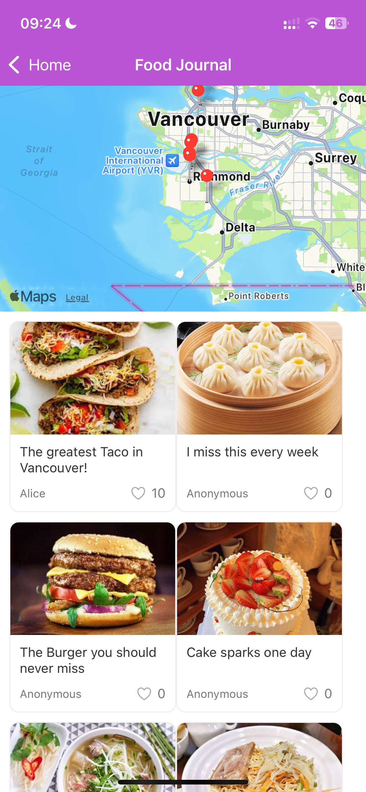

# CuisineHub

## 1. Overview

**Cuisine Hub** is your ultimate guide to discovering and reviewing the best restaurants around you! Whether you're a casual diner or a gourmet enthusiast, Cuisine Hub makes it easy to find new dining spots, share your experiences, and read honest reviews from fellow food lovers. Turn every meal into an adventure with Cuisine Hub.

**Key Features**:

● **Explore Nearby**: Discover the best restaurants around you with our expertly curated recommendations, complete with user reviews and ratings to guide your next meal.

● **Search for Cuisine**: Easily search for specific types of cuisine, dishes, or restaurants to satisfy your cravings.

● **Capture and Share**: Snap and upload stunning photos of your meals, tag the restaurant, and write detailed reviews to share your dining experiences.

● **Personal Food Journal**: Keep a beautifully organized log of all your restaurant visits and reviews, creating a personalized food diary.

● **Local Notifications**: Set reminders for upcoming restaurant visits to ensure you never miss out on the best culinary experiences.

Cuisine Hub transforms dining into a memorable experience. Join us to savor, share, and connect with a world of culinary delights. Make every meal count and start your delicious journey today!**

## 2. Installation

1. **Install dependencies:**

```
cd Cuisine
npm install
```

2. **Set up environment variables:**

Create a `.env` file in the root directory and add your Google Places API Key and Firebase configuration:

```
googlePlacesApiKey=YOUR_GOOGLE_PLACES_API_KEY
apiKey=your-firebase-api-key
authDomain=your-firebase-auth-domain
projectId=your-firebase-project-id
storageBucket=your-firebase-storage-bucket
messagingSenderId=your-firebase-messaging-sender-id
appId=your-firebase-app-id
```

3. **Run the app:**

```
npx expo start --tunnel
```

## 3. Data Model

### 1. Post

* **title (String):** The title of the post.
* **imageUrls (Array):** URLs of images on Storage.
* **place_id (String):** The Google Place ID of the restaurant.
* **author (String):** The UID of author of the post (Get realtime author name by UID from Firestore).
* **comment (String):** The author's content of the post.
* **likedBy (Array):** Array of userId that likes the post .
* **date (String):** The date the post was created in YYYY-MM-DD format.
* **comments (Array):** List of other uers' comments[author(String), text(String), date(String)] on the post.

### 2. User

- **email (String):** The email of the user.
- **name (String):** The name of the user.

### 3. SavedPosts (A User Subcollection)

- **PostID (String):** The post id for the user's favorite/saved post.

## 4. Collections and  CRUD Operations

### 1. Post

* **Description:** Stores all user posts with details about their dining experiences.  Each post includes:  title, comment, images, other users' comments,  etc.
* **CRUD Operations:**
  * **Create:** Implemented in the `PostEditorScreen` where users can create a new post.
  * **Read:**
    * **User Profile:** Users can view and manage their own posts, displaying all their dining experiences in the format of map and list.
    * **DiscoverScreen:** Fetches popular and recent posts shared by other users, helping users discover new and trending dining spots. Posts are sorted based on metrics like the number of likes to highlight popular experiences.
  * **Update:** Users can update posts from their journal.
  * **Delete:** Posts can be deleted directly from the user's journal.

### 2. User

- **Description:** Stores all users with details about their profile information.
- **CRUD Operations:**
  - **Create:** This should get the auth.id from the authenticaiton step when a user first registers from the platform. (Not implemented)
  - **Read:**
    - **User Profile:** User can see their personal profile information with their image.
  - **Update:** Users can update their profile from the profile page. (To be implemented, a function for updating the database is in place.)
  - **Delete:** We have to decide whether a user can delete their profile/account. (To-do)

### 3. Saved Posts/Favorites

- **Description:** Stores ids of all favorited posts a user has liked.
- **CRUD Operations:**
  - **Create:** Adds the id of a post to the SavedPosts subcollection in User.
  - **Read:**
    - **Saved Posts Screen:** Reads the id from SavedPosts and gets the post detail from the post collection.
  - **Delete:** Remove the saved post id from the subcollection.

## 5. Team Members

**Huijia Wang**

**Shurui Xu**

## 6. Iteration Record

### 6.1 Iteration 1

#### Huijia Wang

1. **DiscoverScreen**

* **Functionality** : Enables users to discover and view posts shared by other users.
* **Features** :
  * **Post List** : Displays a grid view of posts using a FlatList component.
  * **Real-Time Updates** : Utilizes Firestore's onSnapshot for real-time updates to the posts.
  * **Navigation** : Users can click on a post to navigate to its detailed view.


2. **PostScreen**

* **Functionality** : Displays detailed information about a specific post when press the post in the DiscoverScreen.
* **Features** :
  * **Image Carousel** : Shows a horizontal carousel of images related to the post.
  * **Restaurant Details** : Displays restaurant details fetched from Google Places using the provided place_id.
  * **Favorites** : Allows users to mark posts as favorites using a heart icon.
  * **Comments Section** : Shows comments left by other users on the post.
  * **Restaurant Navigation** : Users can navigate to a detailed restaurant screen by clicking the restaurant name.


3. **PostEditorScreen**

* **Functionality** : This component handles the creation and editing of posts by users.
* **TO DO in Future**:
  * The editing posts function will be developed in next iteration.
  * The image is now stored by using picture URL from Intenet. Storing image in firebase storage will be suppoted in next iteration.
* **Features** :
  * **Title Input** : Users can enter a title for their post.
  * **Content Input** : Users can add comments or descriptions about their dining experience.
  * **Image Picker** : Allows users to select up to 9 images from their gallery or take new photos using the camera. Duplicates are prevented, and each image can be removed by clicking the 'x' icon on the top right corner.
  * **Google Places Search** : Integrates with the Google Places API to search for and select restaurants.
  * **Form Validation** : Ensures all required fields (title, content, images, place_id) are filled before submission.
  * **Firestore Integration** : Submits the post data to Firestore with fields like title, images, place_id, comment, likes, date, and author (defaults to "Anonymous" if not specified).


4. **FoodJournalScreen**

* **Functionality** : Showcases posts in a map format, emphasizing geographical details.
* **TO DO in Future**:
  * After the project supports authentication, make sure that only show the specific user's posts
  * Support edition and deletion for each post.
* **Features** :
  * **Map Integration** : Displays user posts on a map using React Native Maps and the Google Places API.
  * **Current Location** : Fetches and centers the map on the user's current location, with location permissions requested upon initialization.
  * **Markers** : Adds markers for each post, indicating the location of the restaurants in the map associated with posts.
  * **Post List** : Shows a list of user's posts below the map using a FlatList component.



5. **ImagePickerComponent**

* **Functionality** : Allows users to select and manage images for their posts.
* **Features** :
  * **Gallery and Camera Access** : Users can choose images from the gallery or take photos using the device's camera.
  * **Image Management** : Supports multiple image selection and removal of selected images.
  * **Permissions** : Requests necessary permissions for accessing the camera and photo library.

6. **PostItem Component**

* **Functionality** : Represents a single post in a list format.
* **TO DO in Future**:
  * Update the number of likes in the firestore after user press the like button
* **Features** :
  * **Display** : Shows an image, title, author, and like count for the post.
  * **Interactive** : Allows users to like a post by clicking the heart icon, updating the like count dynamically.
  * **Navigation** : Clicking on the post takes the user to a detailed view.

#### Shurui Xu

- Set-up the initial expo app and firebase connection
- Set-up Google places API key from Google Cloud
- Created search and restaurant screen
- Displays restaurant details (name, ratings, photos, location, opening hour) from Google places details API in restaurant screen
- Used Google places search API to search restaurants nearby
- Created profile screen
- Read profile information from database
- Created saved posts/favorite screen
- Use PostItem in saved posts screen to display all the posts that a user has saved
- 
- 
- 
- 

### 6.2 Iteration 2

#### Huijia Wang

1. **Post Image Storage in Firebase Storage**:

- Implemented functionality to store images associated with posts in Firebase Storage and store the image URI in Firestore.

2. **Post Deletion and Modification**:

   - Enabled the deletion and modification of posts, including the ability to update the restaurant, title, comment content, and images.
   - Ensured that image changes (additions or deletions) are synchronized with Firebase Storage, keeping the storage in sync with the post's data.

     
3. **Like Button Synchronization**:

   - Added functionality to synchronize the like button in both `PostItem` and `PostScreen` components, reflecting the current user's like status.
   - Implemented a system to count likes based on the number of unique user IDs (UIDs) who have liked a post, displaying the like count accurately.

     
4. **Commenting on Posts**:

   - Introduced the ability for users to comment on posts.
   - Comments are stored with the current user's UID and timestamped with the exact date and time.

     
5. **Dynamic Author Display Based on UID**:

   - Modified the system to store the author of posts and comments as UIDs instead of usernames.
   - On display, the system retrieves the latest username from Firestore based on the UID, ensuring that any changes to the username are correctly reflected across the application.
